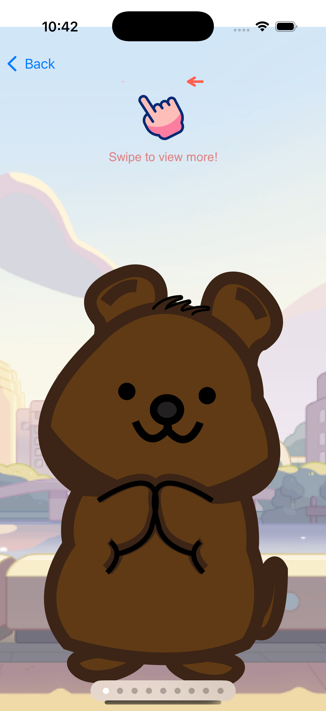
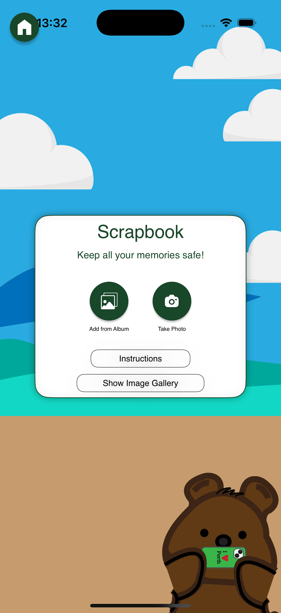
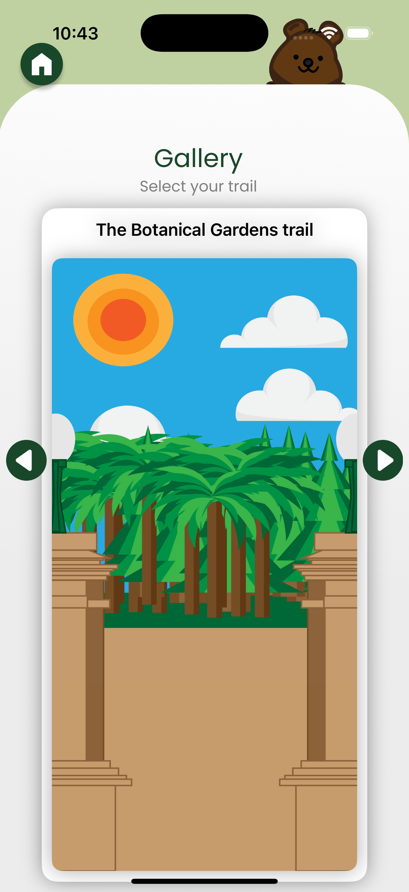
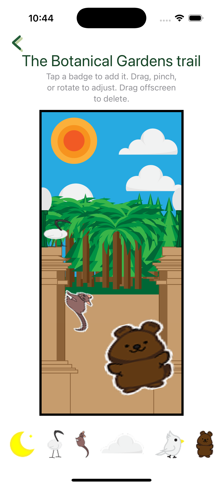

# 🌿 WildTales

**WildTales** is an interactive SwiftUI app that helps users explore trails, take photos, decorate memories with badges, and keep track of adventures in a digital scrapbook.

---

## 🚀 Features

- 🗺️ Trail map with themed locations
- 📸 Interactive photo badge decoration
- 📖 Scrapbook to save trail memories
- 🆘 Emergency button with quick access
- 🎓 Intro guide for first-time users

---

## 📱 Screenshots

<p float="left">
  
  
  
</p>

<p float="left">
  
  
  
</p>

<p float="left">
  
  
</p>

---

## 🛠️ Technologies

- SwiftUI
- AVFoundation 
- CoreGraphics 
- CoreLocation 
- CoreHaptics 
- Local file storage

---

## 🧭 Getting Started

### Requirements
- Xcode 15+
- iOS 17 simulator or later
- (optional) iPhone running iOS 17 or later

### To Run on Simulator (Partial Functionality)
1. Clone this repo:
   ```bash
   git clone https://github.com/TimmyRich/WildTales.git
2. Open project in Xcode
   ```bash
   cd Wildtales/Swift
   open WildTales.xcodeproj
3. Run the app in a simulator
   ```bash
   cmd + r

### Partial Functionality
Adding map locations not fully supported on Xcode simulator. This functionality requires a physyical device.

---

### To Run Natively (Full Functionali
1. Ensure device compatibility with Xcode version 16.3
2. Add an Apple developer account
3. Connect device via usb
4. Trust yourself
5. Build and run application from your connected device in Xcode
